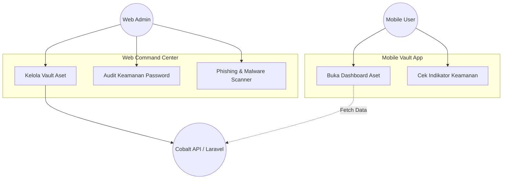
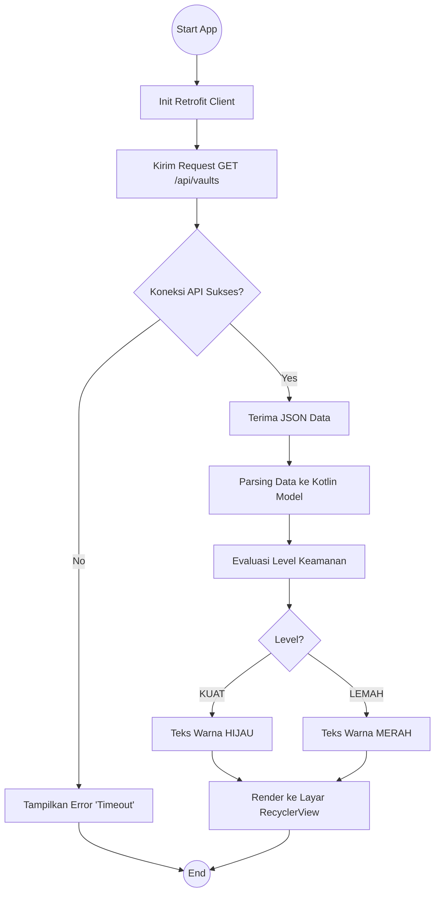
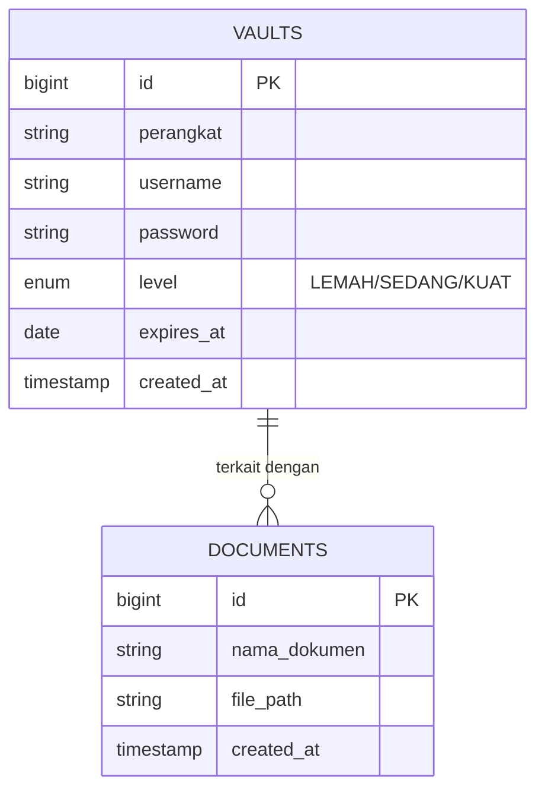

# 🛡️ Aman_Nyaman Ecosystem
**Sistem Manajemen Brankas Digital & Analisis Keamanan Siber (Web & Mobile)**

   


**Aman_Nyaman** adalah ekosistem keamanan digital komprehensif yang terdiri dari **Web Command Center** dan **Mobile Digital Vault**. Dirancang dengan antarmuka futuristik (*Cyberpunk Theme*), sistem ini berfungsi untuk menyimpan, memonitor, dan menganalisis aset rahasia (password, kredensial, dokumen) yang tersinkronisasi secara *real-time* di semua perangkat.

---

## 📖 Deskripsi & Tujuan

Ekosistem ini mengawinkan manajemen basis data yang aman di sisi server dengan aksesibilitas tingkat tinggi di sisi *mobile*. Pengguna dapat mengelola aset di Web dan memantaunya langsung dari HP mereka.

**Tujuan Utama:**
1. Menyediakan *Command Center* (Web) untuk manajemen dan audit aset secara mendalam.
2. Menyediakan *Digital Vault* (Mobile) untuk monitoring aset secara portabel dan *real-time*.
3. Mengotomatisasi analisis kekuatan keamanan (Algoritma Password & Malware/Phishing Scanner).
4. Menyediakan API (Cobalt Protocol) yang aman untuk integrasi lintas platform.

---

## 🛠️ Tech Stack

### 💻 Web Backend (Command Center)
* **Framework:** Laravel 11 (PHP 8.2)
* **Frontend:** Blade Templates + Custom Neon CSS
* **Database:** MySQL 8.0
* **API:** RESTful JSON Endpoint

### 📱 Mobile (Digital Vault)
* **Language:** Kotlin
* **IDE:** Android Studio (API 34 Target)
* **Networking:** Retrofit 2 + GSON Converter
* **UI Components:** RecyclerView, CardView (Cyberpunk UI)

---

## 📋 User Story

| ID | User Story | Target | Priority |
| :--- | :--- | :---: | :--- |
| **US-01** | Sebagai Admin, saya ingin sistem mengaudit kekuatan password saya (Lemah/Kuat). | Web | **High** |
| **US-02** | Sebagai Admin, saya ingin mendeteksi apakah sebuah URL berpotensi Phishing. | Web | **Medium** |
| **US-03** | Sebagai User, saya ingin melihat seluruh aset saya di HP agar mudah dipantau. | Mobile | **High** |
| **US-04** | Sebagai User, saya ingin data di HP otomatis sinkron dengan database server. | Mobile | **High** |

---

## 📝 SRS - Feature List

### 🌐 Fitur Web (Laravel)
* **Vault Management:** CRUD aset digital & kredensial.
* **Security Auditor:** Analisis panjang karakter password dengan output warna.
* **Phishing & Malware Scanner:** Tool analisis link HTTP/HTTPS dan simulasi scan file.
* **Cobalt API Provider:** Penyedia endpoint `/api/vaults`.

### 📱 Fitur Mobile (Android)
* **Live Sync Dashboard:** Menarik data dari server via Retrofit.
* **Visual Indicator:** Mewarnai status keamanan aset (Hijau/Kuning/Merah) secara dinamis.
* **Responsive Layout:** Daftar aset yang tertata rapi menggunakan `RecyclerView`.

---

## 📊 System Architecture & UML

Berikut adalah visualisasi arsitektur ekosistem **Aman_Nyaman**.

### 1. Ekosistem Use Case (Web & Mobile)
Interaksi pengguna di kedua platform.



### 2. Activity Diagram (Mobile Sync Flow)
Alur aplikasi Android mengambil data dari Web.



### 3. Entity Relationship Diagram (Database)
Struktur tabel inti pada server MySQL.



---

## 🔗 API Documentation (Cobalt Protocol)

Endpoint untuk menghubungkan Web dan Mobile.

* **URL:** `/api/vaults`
* **Method:** `GET`
* **Response Success (200 OK):**
```json
{
    "status": "SUCCESS",
    "message": "COBALT_PROTOCOL_SYNC_COMPLETE",
    "data": [
        {
            "id": 1,
            "perangkat": "Server Induk",
            "username": "admin_root",
            "level": "KUAT",
            "expires_at": "2026-12-31"
        }
    ]
}
```

---

## 🚀 Instalasi & Setup (Localhost)

Ikuti urutan ini agar komunikasi Client-Server berjalan lancar.

### TAHAP 1: Menjalankan Server (Web Laravel)
1. Clone repositori ini.
2. Masuk ke folder Web:
```bash
cd AmanNyamanWeb
composer install
cp .env.example .env
php artisan key:generate
php artisan migrate
```
3. **PENTING:** Jalankan server dengan host `0.0.0.0` agar bisa diakses oleh HP/Emulator.
```bash
php artisan serve --host=0.0.0.0 --port=8000
```

### TAHAP 2: Menjalankan Klien (Mobile Android)
1. Buka folder Mobile (`AmanNyamanMobile`) menggunakan **Android Studio**.
2. Buka file `app/src/main/java/.../MainActivity.kt`.
3. Sesuaikan **IP Address** pada `BASE_URL`:
```kotlin
// Jika menggunakan Emulator Android Studio:
private val BASE_URL = "[http://10.0.2.2:8000/](http://10.0.2.2:8000/)"

// Jika menggunakan HP Fisik (Cek IP Laptop via ipconfig):
// private val BASE_URL = "[http://192.168.1.](http://192.168.1.)X:8000/"
```
4. Tunggu *Gradle Sync* selesai, lalu klik tombol **Run (▶)**.

---

## 🎨 System Screenshots

*(Ganti link di bawah dengan screenshot asli aplikasi Anda)*

| Web: Dashboard | Web: Malware Lab | Mobile: Sync Dashboard |
| :---: | :---: | :---: |
|  |  |  |

---

## 👨‍💻 Author

**[Rahadian Ronggo Kusumo]**
*Taruna/Mahasiswa - Politeknik Siber dan Sandi Negara*
*Program Studi Keamanan Siber*

> *"Securing the Future, One Byte at a Time."* 🔐📱
