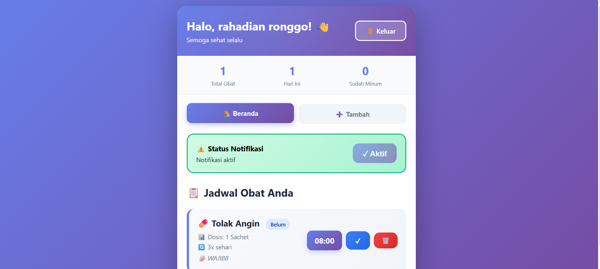

#  MedReminder - Dokumentasi Project (Progress Report)

Aplikasi **MedReminder** adalah solusi digital berbasis web untuk membantu pengguna mengelola jadwal konsumsi obat secara tepat waktu. Dokumentasi ini disusun untuk memenuhi standar laporan progres pengembangan perangkat lunak.

---

##  Deskripsi Proyek
MedReminder adalah aplikasi manajemen kesehatan pribadi yang berfokus pada kedisiplinan minum obat. Aplikasi ini memungkinkan pengguna untuk mencatat daftar obat, mengatur waktu konsumsi, dan mendapatkan pengingat otomatis melalui sistem notifikasi suara.

##  User Story
* **Sebagai Pengguna**, saya ingin mendaftarkan akun agar data jadwal obat saya tersimpan secara pribadi.
* **Sebagai Pengguna**, saya ingin menambahkan jadwal obat baru agar saya memiliki daftar pengingat yang terorganisir.
* **Sebagai Pengguna**, saya ingin mendapatkan notifikasi suara agar saya tidak melewatkan waktu minum obat meskipun tidak melihat layar.
* **Sebagai Pengguna**, saya ingin melihat dashboard harian untuk mengetahui obat apa saja yang sudah dan belum diminum.

##  SRS (Software Requirements Specification)
### Feature List
1. **Sistem Autentikasi**: Registrasi akun dan Login pengguna.
2. **Dashboard Interaktif**: Ringkasan total obat, jadwal hari ini, dan status penyelesaian.
3. **Manajemen Obat (CRUD)**: Tambah, Lihat, Edit, dan Hapus jadwal obat secara bebas.
4. **Notifikasi Suara Otomatis**: Trigger suara alarm sesuai waktu yang diinputkan.
5. **Kontrol Notifikasi**: Fitur untuk mengaktifkan/menonaktifkan alarm secara global.

##  UML (Unified Modeling Language)

* **Use Case Diagram**: Menggambarkan interaksi aktor (Pengguna) dengan fitur utama seperti Register, Login, Tambah Obat, dan Terima Notifikasi.
* **Activity Diagram**: Menjelaskan alur kerja dari saat pengguna membuka aplikasi hingga berhasil menambahkan jadwal obat.
* **Sequence Diagram**: Menunjukkan interaksi antar objek (UI, Controller, Database) dalam proses validasi login dan penyimpanan data obat.

##  Cara Instalasi (SDLC - Deployment)

1. **Persiapan**: Pastikan XAMPP (Apache & MySQL) sudah terpasang.
2. **Clone/Download**: Download source code ini dan letakkan di `C:\xampp\htdocs\medreminder`.
3. **Database**: 
   - Buat database `db_medreminder` di `localhost/phpmyadmin`.
   - Import file `db_medreminder.sql`.
4. **Konfigurasi**: Sesuaikan file `koneksi.php` dengan kredensial database lokal Anda.
5. **Running**: Buka browser dan akses `localhost/medreminder`.

---

##  Teknologi & SDLC
* **Metode Pengembangan**: Waterfall.
* **Stack**: PHP Native, MySQL, HTML5, CSS3 Modern UI, JavaScript.

##  Developer
* **Nama**: Rahadian Ronggo Kusumo [mr.g9]
* **Tugas**: Project Website Management - II RKS A
